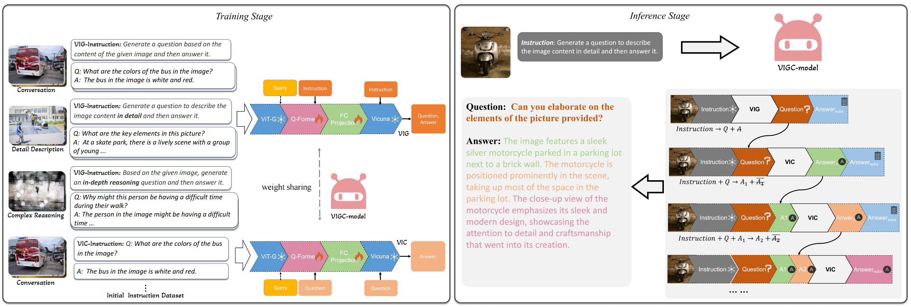

# VIGC: Visual Instruction Generation and Correction

We propose **Visual Instruction Generation and Correction (VIGC)**, a framework capable of autonomously generating high-quality image-text instruction fine-tuning datasets.

<p align="center">
    <br>
    
    <br>
<p>

## Table of Contents
  - [Getting Started](#getting-started)
    - [Installation](#installation)
    - [Prepare Models](#prepare-models)
    - [Launching Demo](#launching-demo)
  - [Tutorials](#tutorials)
    - [Generate QA](#generate-qa)
    - [Train VIGC Model](#train-vigc-model)
  - [Acknowledgement](#acknowledgement)
  - [Paper and Citing VIGC](#paper-and-citing-vigc)
  - [License](#license)

## Getting Started

### Installation

1. (Optional) Creating conda environment

   ```bash
   conda create -n vigc python=3.8
   conda activate vigc
   ```

2. Install mmpretrain

   you can follow the [tutorial](https://github.com/open-mmlab/mmpretrain#installation)

3. You may build from source

   ```bash
   git clone https://gitlab.pjlab.org.cn/fdc/mllm/vigc.git
   cd vigc
   pip install -e .
   ```

### Prepare Models
1. obtain vicuna model

   Vicuna is an open-source LLAMA-based LLM that has a performance close to ChatGPT. We currently use the v1.1 version of Vicuna-13B and 7B. If you already have the Vicuna weights with correct version, modify the `llm_model` in [Model Config](vigc/configs/models/mini_gpt4_vicuna13b.yaml) to the folder that contains your Vicuna weights. Otherwise, you can follow [this instruction](GetVicuna.md) to get them, remenber that modify the config file too.

2. download pretrain model

   We support two different kinds of pretrain checkpoints to load from: minigpt-4 and instrucblip. You can download them from the table below, more details please visit their original repositories: [minigpt-4](https://github.com/Vision-CAIR/MiniGPT-4/blob/main/README.md##3) and [instrucblip](https://github.com/salesforce/LAVIS/tree/main/projects/instructblip).

   | Model Type | Checkpoint pretrained with Vicuna 7B | Checkpoint pretrained with Vicuna 13B |
   :-------------------:|:--------------------:|:------------------:
   minigpt-4 | [Download](https://drive.google.com/file/d/1HihQtCEXUyBM1i9DQbaK934wW3TZi-h5/view?usp=share_link) | [Download](https://drive.google.com/file/d/1u9FRRBB3VovP1HxCAlpD9Lw4t4P6-Yq8/view?usp=share_link) 
   instrucblip | [Download](https://storage.googleapis.com/sfr-vision-language-research/LAVIS/models/InstructBLIP/instruct_blip_vicuna7b_trimmed.pth) | [Download](https://storage.googleapis.com/sfr-vision-language-research/LAVIS/models/InstructBLIP/instruct_blip_vicuna13b_trimmed.pth)

   After download the pretrained checkpoints, please modify the `pretrained` in [Model Config](vigc/configs/models/mini_gpt4_vicuna13b.yaml) to the folder that contains pretrain weights.

3. download fintuned vigc model

   Download the pretrained vigc checkpoints according to fintuned dataset and the Vicuna model you prepared.
   | Fintuned Dataset | Checkpoint Fintuned with Vicuna 7B | Checkpoint Fintuned with Vicuna 13B |
   :-------------------:|:--------------------:|:------------------:
   LLaVA | [Download](https://huggingface.co/wufan/vigc7b_minigpt4_llava) | [Download](https://huggingface.co/wufan/vigc13b_minigpt4_llava) 
   OKVQA | [Download](https://huggingface.co/wufan/vigc7b_instrucblip_okvqa) | / 
   A-OKVQA | [Download](https://huggingface.co/wufan/vigc7b_instrucblip_a-okvqa) | / 


### Launching Demo

   To Launch a demo locally, you should:

1. Download the pretrain weight and finetune weight of minigpt-4 and instructblip to local;

2. Update `MODEL_CKPT` in line 9 of `vigc_demo.py`；

3. Run ```python vigc_demo.py``` and then follow the instruction on the prompts to view in browser. Arguments are as follows:

      - device0: The gpu id of the first model

      - device1: The gpu id of the second model


​	You can also  visit [](https://openxlab.org.cn/apps/detail/hanxiao/VIGC) to play with VIGC online demo.

## Tutorials


### Generate QA

1. generate QA based on COCO2017 for Llava

   1. You should first download the finetuned vigc model
   2. Then modify the `finetuned` in corresponding Inference Config to the path to the checkpoint file.

   ```bash
   torchrun --nproc_per_node=8 evaluate.py --cfg-path vigc/projects/mini_gpt4_vicuna7b/generate_qa/llava-150k/generate_llava_qa_conv.yaml   # generate conversation data for Llava using MiniGPT4-vicuna7b
   
   torchrun --nproc_per_node=8 evaluate.py --cfg-path vigc/projects/mini_gpt4_vicuna7b/generate_qa/llava-150k/generate_llava_qa_detail.yaml   # generate detail description data for Llava using MiniGPT4-vicuna7b
   
   torchrun --nproc_per_node=8 evaluate.py --cfg-path vigc/projects/mini_gpt4_vicuna7b/generate_qa/llava-150k/generate_llava_qa_complex.yaml   # generate complex reasoning data for Llava using MiniGPT4-vicuna7b
   
   torchrun --nproc_per_node=8 evaluate.py --cfg-path vigc/projects/mini_gpt4_vicuna13b/generate_qa/llava-150k/generate_llava_qa_conv.yaml   # generate conversation data for Llava using MiniGPT4-vicuna13b
   
   torchrun --nproc_per_node=8 evaluate.py --cfg-path vigc/projects/mini_gpt4_vicuna13b/generate_qa/llava-150k/generate_llava_qa_detail.yaml   # generate detail description data for Llava using MiniGPT4-vicuna13b
   
   torchrun --nproc_per_node=8 evaluate.py --cfg-path vigc/projects/mini_gpt4_vicuna13b/generate_qa/llava-150k/generate_llava_qa_complex.yaml   # generate complex reasoning data for Llava using MiniGPT4-vicuna13b
   ```

2. generate QA based on Object365 for Llava

   1. You should first download the finetuned vigc model
   2. Then modify the `finetuned` in corresponding Inference Config to the path to the checkpoint file.

   ```bash
   torchrun --nproc_per_node=8 evaluate.py --cfg-path vigc/projects/mini_gpt4_vicuna7b/generate_qa/llava-150k/generate_llava_qa_object365_conv.yaml   # generate conversation data for Llava using MiniGPT4-vicuna7b
   
   torchrun --nproc_per_node=8 evaluate.py --cfg-path vigc/projects/mini_gpt4_vicuna7b/generate_qa/llava-150k/generate_llava_qa_object365_detail.yaml  # generate detail description data for Llava using MiniGPT4-vicuna7b
   
   torchrun --nproc_per_node=8 evaluate.py --cfg-path vigc/projects/mini_gpt4_vicuna7b/generate_qa/llava-150k/generate_llava_qa_object365_complex.yaml   # generate complex reasoning data for Llava using MiniGPT4-vicuna7b
   
   torchrun --nproc_per_node=8 evaluate.py --cfg-path vigc/projects/mini_gpt4_vicuna13b/generate_qa/llava-150k/generate_llava_qa_object365_conv.yaml   # generate conversation data for Llava using MiniGPT4-vicuna13b
   
   torchrun --nproc_per_node=8 evaluate.py --cfg-path vigc/projects/mini_gpt4_vicuna13b/generate_qa/llava-150k/generate_llava_qa_object365_detail.yaml   # generate detail description data for Llava using MiniGPT4-vicuna13b
   
   torchrun --nproc_per_node=8 evaluate.py --cfg-path vigc/projects/mini_gpt4_vicuna13b/generate_qa/llava-150k/generate_llava_qa_object365_complex.yaml   # generate complex reasoning data for Llava using MiniGPT4-vicuna13b
   ```

3. generate QA based on COCO2017 for A-OKVQA or OKVQA

   1. You should first download the finetuned vigc model

   2. Then modify the `pretrained` in corresponding Inference Config to the path to the checkpoint file.

   3. Generate the question first:

      ```bash
      torchrun --nproc_per_node=8 evaluate.py --cfg-path vigc/projects/instruct_blip_vicuna7b/generate_qa/a-okvqa/generate_question.yaml   # generate questions for A-OKVQA using instruct-blip-vicuna7b
      
      torchrun --nproc_per_node=8 evaluate.py --cfg-path vigc/projects/instruct_blip_vicuna7b/generate_qa/okvqa/generate_question.yaml   # generate questions for OKVQA using instruct-blip-vicuna7b
      ```

   4. Modify the `annotaion` in `generate_answer.yaml` to the path of the questions generated in the above step, then generate the answers: 

      ```bash
      torchrun --nproc_per_node=8 evaluate.py --cfg-path vigc/projects/instruct_blip_vicuna7b/generate_qa/a-okvqa/generate_answer.yaml   # generate answers for A-OKVQA using instruct-blip-vicuna7b
      
      torchrun --nproc_per_node=8 evaluate.py --cfg-path vigc/projects/instruct_blip_vicuna7b/generate_qa/okvqa/generate_answer.yaml   # generate answers for OKVQA using instruct-blip-vicuna7b
      ```

### Train VIGC Model

1. Finetune VIGC Model on A-OKVQA Dataset

   1. download our formatted [A-OKVQA json files](https://drive.google.com/drive/folders/1fzOF9MX5tt-aluf-KvYIR7rRlwBY97o8?usp=drive_link)
   2. download iamges follow the [original repo](https://github.com/allenai/aokvqa), skip this step if you already have them.
   3. modify `images` and `annotation` in these configs:[train config](vigc/configs/datasets/a-okvqa/vig/train.yaml), [val config](vigc/configs/datasets/a-okvqa/vig_eval.yaml), with their actual paths.
   4. run finetune script

      ```python
      torchrun --nproc_per_node=8 train.py --cfg-path vigc/projects/instruct_blip_vicuna7b/vigc/a-okvqa/normal_vigc.yaml
      ```

2. Finetune VIGC Model on OKVQA Dataset
   1. download our formatted [OKVQA json files](https://drive.google.com/drive/folders/18ybg-3RjtN8w0gnv0rjAzdwbDOB7CuWF?usp=drive_link)
   2. download iamges follow the [original repo](https://okvqa.allenai.org/), skip this step if you already have them. 
   3. modify `images` and `annotation` in these configs:[train config](vigc/configs/datasets/okvqa/vig/train.yaml), [val config](vigc/configs/datasets/okvqa/vig_eval.yaml), with their actual paths.
   4. run finetune script
      ```bash
      torchrun --nproc_per_node=8 train.py --cfg-path vigc/projects/instruct_blip_vicuna7b/vigc/okvqa/normal_vigc.yaml
      ```

3. Finetune VIGC Model on LLaVA-150k Dataset
   1. download our formatted [LLaVA json files](https://drive.google.com/drive/folders/1yFTZlMR1KoFrPiVBYNncVsw5zOEKbj0s?usp=drive_link) 
   2. download iamges follow the [original repo](https://github.com/haotian-liu/LLaVA), skip this step if you already have them.
   3. modify `images` and `annotation` in these configs:[conversation config](vigc/configs/datasets/llava_instruct150k/vig/trainval_llava_conv.yaml), [detail config](vigc/configs/datasets/llava_instruct150k/vig/trainval_llava_desc.yaml), [complex config](vigc/configs/datasets/llava_instruct150k/vig/trainval_llava_comp.yaml), [val config](vigc/configs/datasets/llava_instruct150k/vig_eval.yaml), with their actual paths.
   4. run finetune script
      ```bash
      torchrun --nproc_per_node=8 train.py  --cfg-path vigc/projects/mini_gpt4_vicuna7b/vigc/llava-150k/normal_vigc.yaml  # using Mini-GPT4 Vicuna7b
      
      torchrun --nproc_per_node=8 train.py  --cfg-path vigc/projects/mini_gpt4_vicuna13b/vigc/llava-150k/normal_vigc.yaml  # using Mini-GPT4 Vicuna13b
      ```

## Acknowledgement

   - [BLIP2](https://github.com/salesforce/LAVIS/tree/main/projects/blip2). The model architecture of VIGC follows BLIP-2. Don't forget to check this great open-source work if you don't know it before!
   - [InstrucBlip](https://github.com/salesforce/LAVIS/tree/main/projects/instructblip) and [MiniGPT-4](https://github.com/Vision-CAIR/MiniGPT-4/blob/main/README.md##3). The pretrain models of VIGC are come from InstrucBlip and MiniGPT-4.
   - [Lavis](https://github.com/salesforce/LAVIS). This repository is built upon Lavis!
   - [Vicuna](https://github.com/lm-sys/FastChat). The fantastic language ability of Vicuna with only 13B parameters is just amazing. And it is open-source!
   - [LLaVA](https://github.com/haotian-liu/LLaVA), [A-OKVQA](https://github.com/allenai/aokvqa), [OKVQA](https://okvqa.allenai.org/). The model of VIGC are finetuned on these datasets.


## Paper and Citing VIGC

You can find more details in our [paper](https://arxiv.org/abs/2308.12714).

If you're using VIGC in your research or applications, please cite using this BibTeX:

```bibtex
@article{wang2023vigc, 
      title={VIGC: Visual Instruction Generation and Correction},
      author={Wang, Bin and Wu, Fan and Han, Xiao and Peng, Jiahui and Zhong, Huaping and Zhang, Pan and Dong, Xiaoyi and Li, Weijia and Li, Wei and Wang, Jiaqi and He, Conghui},
      journal={arXiv preprint arXiv:2308.12714},
      year={2023}
}
```

## Contact us
If you have any questions, comments or suggestions, please do not hesitate to contact us at wangbin@pjlab.org.cn or wufan@pjlab.org.cn.

## License
[Apache License 2.0](LICENSE.txt)
